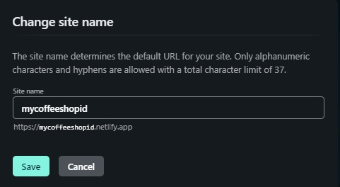

# Deploy a Website on Netlify & Setup Custom Domain

> Assignment for RevoU - FSSE week 4

## Deployment on Netlify

1. Go to https://www.netlify.com, click **Sign up** or **Log in** if you already have an account.

   

2. Log in with one of the following acccount.

   

3. Go to **Sites** page, and then click **Add new site**

   

4. Choose **Import an existing project** and **GitHub** if you already have a repository you want to deploy.

   

   

5. Select a repository that you want to deploy.

   

6. Configure the settings and click **Deploy site**

   

7. Your website has been deployed with the URL given by netlify.

   

8. If you want to customize your domain, open **Site settings** and click **Change site name**.

   

9. Enter with your desired name, then click **Save**.

   

10. Your website has been deployed.

## Buy a Custom Domain on Niagahoster

1. Go to https://www.niagahoster.co.id, then **Log in** with your account.

   

2. Choose **Domain** and click **Order sekarang** for buying a domain.

   

3. Fill your desired name, then choose one available domain. After that, click **Pilih** for the next process.

   

4. Check your domain, then click **Lanjutkan** for the payment process.

   

5. After you complete your payment, you can use your domain.

## Connect Website to Domain and DNS

1. Go to https://www.cloudflare.com, then **Log in** with your account.

   

2. Click **Add site** on navigation bar. Fill your domain, then click **Add site** button.

   

3. For this project, we will choose **free plan**, then click **continue**.

   

4. Click **Add record** for manage the DNS.

   

5. Choose **CNAME** as the **type**, fill your new domain in **Name** and fill your netlify's domain in **Target**. Then, click **Continue**.

   

   

6. Go to https://client.niagahoster.co.id, click **layanan** on navigation bar, then choose **Layanan Saya**. Find your domain, then click **Kelola Layanan**.

   

7. Click **Ubah Nameserver**, fill the nameserver that provided by the cloudflare.

   
   

8. Back to netlify, then choose **Set up a custom domain**.

   

9. Fill your new domain.

   

10. Done! Your website can be accessed by your new domain.
